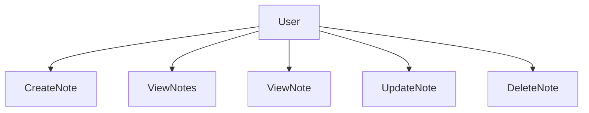
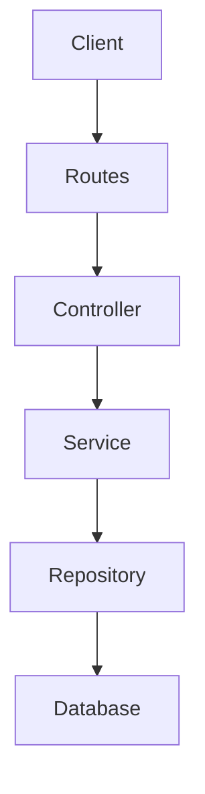
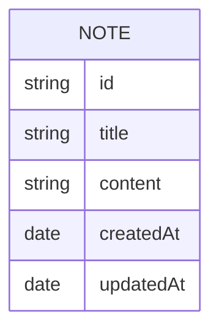

## 1️⃣ Idea

Explain **what problem the project solves**.

Example:

```
Notes API is a backend service that allows users to -create
-read
-update
-delete notes.

Goal:
Learn clean backend architecture using MERN stack principles
such as controller-service-repository separation.
```

---

## 2️⃣ Requirement Analysis
#### User Flow


---

## 4️⃣ LLD Design (Architecture)

Show **layer separation**.



Explain in **3 lines only**.

```
Routes handle endpoint mapping.
Controllers process requests.
Services contain business logic.
Repositories interact with the database.
```

---

## 5️⃣ API Design

You can include **API table or OpenAPI-like structure**.

Example:

### Create Note

```
POST /notes
```

Body:

```
{
  "title": "Meeting notes",
  "content": "Discuss project architecture"
}
```

Response:

```
201 Created
```
Use a **simple table** (this is very readable).

| Feature     | API               | Purpose     |
| ----------- | ----------------- | ----------- |
| Create Note | POST /notes       | Add note    |
| Get Notes   | GET /notes        | List notes  |
| Get Note    | GET /notes/:id    | Fetch note  |
| Update Note | PUT /notes/:id    | Modify note |
| Delete Note | DELETE /notes/:id | Remove note |


---

## 6️⃣ Database Design

Use **Mermaid ER Diagram**.



---

## 7️⃣ Component Design

Explain **project folder structure**.

```
src
 ├ controllers
 │   └ noteController.js
 ├ services
 │   └ noteService.js
 ├ repositories
 │   └ noteRepository.js
 ├ models
 │   └ noteModel.js
 ├ routes
 │   └ noteRoutes.js
 └ validators
     └ noteValidator.js
```